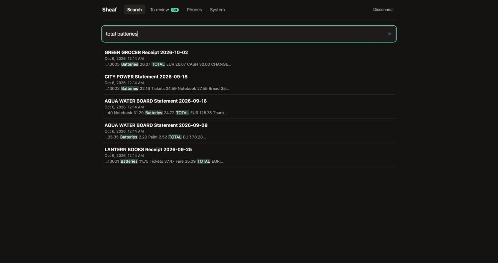
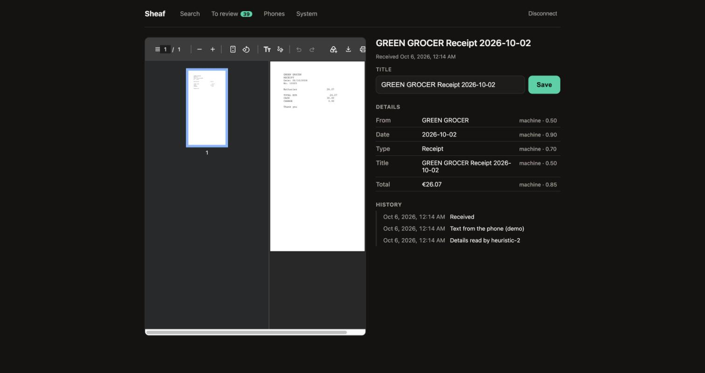
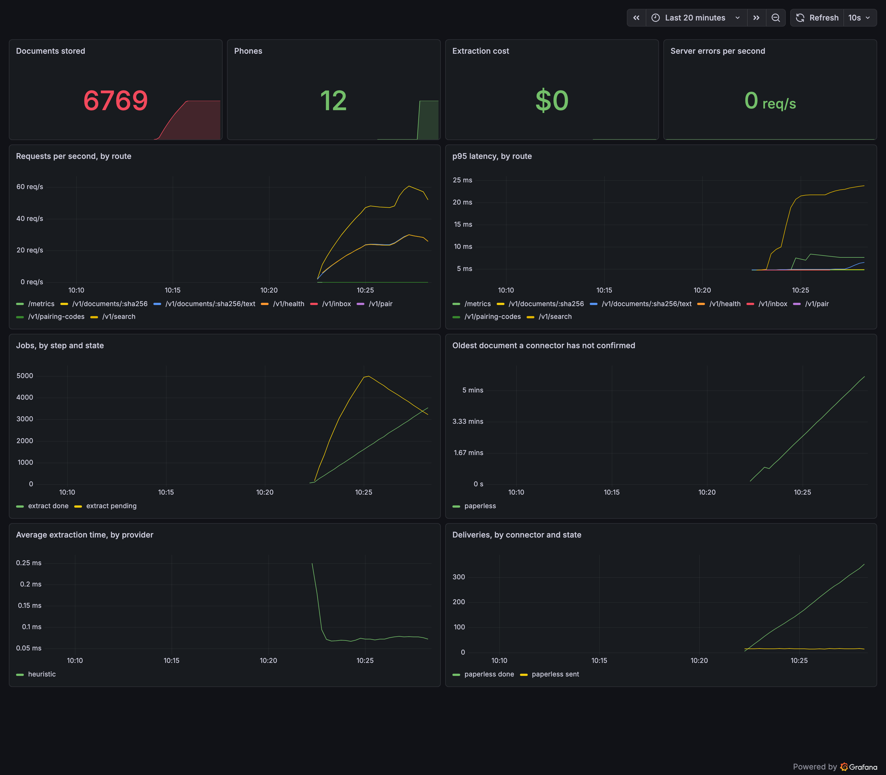

# Sheaf

**Offline-first document capture with a server that keeps, reads and searches your
documents — and forwards copies to Paperless-ngx, a folder or S3 only if you ask.**

Scan a document; it is already safe. Everything after that is optional.

[](https://github.com/) [](https://www.typescriptlang.org/) [](LICENSE)

> Sheaf is an independent project. It is not affiliated with, endorsed by, or an
> official part of [Paperless-ngx](https://github.com/paperless-ngx/paperless-ngx).



|                                    |                                                                                                   |
| ---------------------------------- | ------------------------------------------------------------------------------------------------- |
| **0** documents lost or duplicated | Across 3,644 simulated process kills, and a real 500-document load through 3 `SIGKILL`s           |
| **728** tests                      | Every one run in CI; coverage floors enforced on the pure packages                                |
| **84%** on the hardest field       | Total extracted at **$0.00 per document** by the default regex extractor — Claude/Ollama optional |

**Looking for a specific kind of engineering?** [`docs/FOR-REVIEWERS.md`](docs/FOR-REVIEWERS.md)
maps "distributed systems", "mobile", "AI/ML" and "full-stack" to the exact files.

---

## The problem

Getting a piece of paper _into_ a document system, from a phone, is the part that
still hurts:

> photograph → crop → fix perspective → save → find the file → share/upload → wait
> for OCR → categorise → fix the metadata → check it actually arrived

Every existing mobile flow puts a form between the paper and the server. That form
is the friction. And until recently the answer to "where does it live" was "wherever
Paperless-ngx is" — so the phone, the OCR, the search and the AI were all somebody
else's project.

## The idea

Two inversions.

**1. Commit the instant the shutter fires.** The document is durable locally before
it is cropped, named or understood, and upload starts in the background. Cropping,
OCR, metadata and the human all happen _after_, and none of them can block delivery.

```
SHUTTER ──▶ durable local commit ──▶ upload starts now (background)
                                          │
                              the server keeps it, indexes it
                                          │
              later, whenever you feel like it:
              TRIAGE ──▶ patch metadata on a document that is already safe
```

**2. The server is the system of record** ([ADR 0007](docs/adr/0007-sheaf-is-the-system-of-record.md)).
Sheaf's own server stores every document, searches its text, and fills in title,
date, sender, type and total. Paperless-ngx is no longer a dependency — it is a
**connector**: a destination that receives a copy if you configure one.

```bash
docker compose up -d                              # just Sheaf: capture, search, AI fields
docker compose -f compose.yml -f compose.paperless.yml up -d   # and Paperless too
```

Practical consequences:

- **Batch capture is the default.** Shoot through a pile of thirty receipts without
  leaving the camera.
- **There is no review screen before upload.** There is an inbox of already-synced
  documents waiting to be classified — accept a suggestion, or correct it.
- **Nothing is ever "waiting for the user."** The only queue is the outbox.
- **Search works from the first document**, because the phone recognises the text
  on-device and sends it along ([ADR 0009](docs/adr/0009-edge-first-ocr.md)).

## Why the engineering is interesting

Fast, trustworthy capture is not a UI problem; it is a durability problem. Three
decisions carry the design.

### 1. An append-only intent log, not a mutable row

Every fact about a document is an event. `DocState` — including its status — is
_derived_ by replaying the log. Nothing is ever updated or deleted.

A crash can only truncate an append-only log at a record boundary, so replay always
yields a valid state. Crash recovery stops being recovery logic and becomes a
property of the data structure, and illegal state transitions are unrepresentable
because status is not stored. ([ADR 0001](docs/adr/0001-append-only-intent-log.md))

### 2. Content-addressing turns at-least-once into exactly-once

`docId = SHA-256(normalized PDF bytes)`. The hash _is_ the identity.

The failure nobody handles: you upload a document, the server stores it, and the
reply is lost to a tunnel. Retry, and you have two copies. Give up, and you show a
red error on a document that is safely stored.

Sheaf closes it by **resolving uncertainty with a `HEAD` before resending**, and by
treating the server's word as final. ([ADR 0002](docs/adr/0002-exactly-once-via-content-addressing.md))

### 3. The server is authoritative about what happened

On every cold start, any document whose fate is unknown is reconciled against the
server before anything else is decided. The log is authoritative about _intent_;
the server is authoritative about _outcome_.

### The paper trail

Because the log exists, "details" renders the real history:

```
10:32:04  Captured (4 pages)
10:32:05  Upload attempt 1 → server unreachable
10:40:51  Network returned (Wi-Fi)
10:40:52  Upload attempt 3 → accepted
10:41:09  Text sent from the phone
10:41:12  Details read by heuristic-2
10:44:22  You accepted the suggestions
```

Most apps _assert_ they never lose a document. This one shows its receipts — and
the feature cost nothing, because it is one query against the log.

## What it looks like

The web app reads the same server the phone writes to. The document page shows
every field with **where it came from** — `machine · 0.85` or `you` — and the paper
trail below it:



## Status

What works today, and how each part is checked:

| Part                                              | State                                              | Checked by                                                                                                          |
| ------------------------------------------------- | -------------------------------------------------- | ------------------------------------------------------------------------------------------------------------------- |
| Capture and exactly-once delivery                 | Done                                               | Unit tests, and a simulator: 3,644 process kills, nothing lost or duplicated                                        |
| Server as system of record                        | Done                                               | Job runner and connectors under fault simulation; migrations tested on a real old database                          |
| Search                                            | Done                                               | FTS5; p95 16.7 ms over 10,000 documents (`pnpm bench:search`)                                                       |
| On-device text sent to the server                 | Done                                               | Engine tests and the simulator                                                                                      |
| Reading details (title, date, total…)             | Done: rules by default; Claude or Ollama by choice | [Eval](packages/extract/eval/report.md) on 50 held-out SROIE receipts: date 98%, total 84%, sender 96%; gated in CI |
| Phone app (iOS)                                   | Builds and boots in the Simulator                  | Typecheck, Metro bundle in CI. **Not yet used on a real phone**                                                     |
| Phone app (Android)                               | Configured                                         | **Not yet built**                                                                                                   |
| Web app (search, document, inbox, phones, system) | Done                                               | Typecheck, 10 tests, bundled in CI. Used in a browser, against a seeded server                                      |
| Pairing, metrics, observability                   | Done                                               | Router and registry tests; a real Prometheus + Grafana stack with a provisioned dashboard                           |
| Server-side OCR (optional)                        | Done                                               | Sidecar tests against a stand-in; the real container read an image-only receipt word for word                       |
| Paperless-ngx (optional connector)                | Done                                               | Contract tests against a real 3.2.1, weekly in CI                                                                   |
| Chaos under load                                  | Done                                               | `pnpm chaos`: 20 phones × 25 documents, 3 `SIGKILL`s, 0 lost / 0 duplicated — green on three seeds                  |
| Inbox on the phone                                | Done (buttons; swipe pending)                      | Projection tests; typecheck and bundle. **Not yet tapped**                                                          |

**Not done, stated plainly:** no physical-device run yet (the camera and permission
prompts are untested), Android unbuilt, the inbox swipe gesture unimplemented, and
search is BM25 rather than semantic. See [`docs/FOR-REVIEWERS.md`](docs/FOR-REVIEWERS.md).

## Architecture

```
Phone (Expo)                          Server (Node, no runtime dependencies)
┌──────────────────────────┐          ┌────────────────────────────────────────────┐
│ camera → intent log      │  PUT     │ HTTP /v1 → objects/ by sha256               │
│ core (pure) → engine     │ ───────► │             ingest.db: catalog, jobs,        │
│ on-device OCR (Vision/   │          │             deliveries, text, FTS5          │
│ ML Kit)                 │  text    │             job runner (steps, retries)      │
└──────────────────────────┘ ───────► │             connector per destination       │
                                     └────────────────────────────────────────────┘
                                                    │ optional
                                          Paperless-ngx · folder · S3
```

`packages/core` has no clock, no randomness and no I/O — ESLint enforces this by
banning `Date.now()` and `Math.random()` inside it. Time and jitter arrive as
parameters, which is what lets the simulator explore fault schedules
deterministically and replay any failing seed exactly.

Across 300 hostile schedules covering 1,500 documents — dropped requests, lost
replies after the server had already stored the document, 5xx, 401, rate limits,
offline windows, and 3,644 process kills including kills _between_ logging an upload
attempt and logging its outcome — the engine issued 2,003 POSTs, stored exactly 1,500
documents, read 490 duplicate rejections as success, and recovered 255 interrupted
uploads with a hash lookup rather than a re-upload. Nothing lost, nothing duplicated.

See [ARCHITECTURE.md](ARCHITECTURE.md) and the [decision records](docs/adr).

## Development

```bash
pnpm install
pnpm verify      # format check + lint + typecheck + tests
```

Run the server:

```bash
echo "SHEAF_TOKEN=$(node -e "console.log(require('crypto').randomBytes(32).toString('hex'))")" > .env
docker compose up -d
```

The token has no default — a server holding your documents should not come up
guessable, so it would rather not come up at all.

Optional add-ons combine:

```bash
# forward copies to Paperless-ngx (it fetches its own token once it has booted)
echo "PAPERLESS_ADMIN_PASSWORD=$(node -e "console.log(require('crypto').randomBytes(12).toString('base64url'))")" >> .env
docker compose -f compose.yml -f compose.paperless.yml up -d

# read documents that arrive with no text, with OCRmyPDF
docker compose -f compose.yml -f compose.ocr.yml up -d

# Prometheus + a provisioned Grafana dashboard
docker compose -f compose.yml -f compose.observability.yml up -d
```

Then the app, and the web client:

```bash
pnpm --filter @sheaf/mobile start    # needs a dev build; expo-sqlite & co. are native
pnpm --filter @sheaf/web dev         # http://localhost:5173
```

The other entry points: `pnpm test:contract` (a real Paperless-ngx),
`pnpm chaos` (load + `SIGKILL`s), `pnpm eval` (extraction accuracy),
`pnpm bench:search`, `pnpm seed` (synthetic documents for demos).

## Verification

728 tests, with coverage floors on the pure packages. What each layer is worth:

| Layer         | What it proves                                                                                                                                       |
| ------------- | ---------------------------------------------------------------------------------------------------------------------------------------------------- |
| `core`, `pdf` | Pure; ~100% of statements. SHA-256 cross-checked against `node:crypto` at every length 0–200. Assembled PDFs parsed and rendered by **Ghostscript**. |
| `store`       | Real SQL against `node:sqlite`; both log implementations held to one parametrised suite.                                                             |
| `sim`         | The engine over a virtual clock and seeded faults: 3,644 process kills, nothing lost or duplicated.                                                  |
| `ingest`      | The server: job convergence under crashes, connector independence, migrations against a real old database, search p95 at 10,000 documents.           |
| `paperless`   | Every branch against an injected transport — **and** contract tests against a real Paperless-ngx, weekly in CI.                                      |
| `extract`     | One suite over all three extractors, plus an eval on held-out data that fails CI if accuracy regresses.                                              |
| `apps/mobile` | Typechecked and linted. **Never run on a device** — see above.                                                                                       |
| `apps/web`    | 10 tests over routing and formatting; typechecked, linted and bundled in CI; driven in a real browser against a seeded server.                       |

**Defects were found by tests and probes written to be hard rather than to pass.**
A few of the best:

- **The simulator's own fake server** consumed a task only when polled, making the
  duplicate path unreachable — the suite passed while testing nothing.
- **SHA-256 padding** added an extra block whenever `length + 9` was a multiple of 64.
  All three published vectors passed; lengths 55, 119 and 183 did not.
- **Reconciliation** would have trusted a server-side filter that DRF silently
  ignores, marking un-uploaded documents as synced.
- **Suggestions were retried for ever.** A server answering 404 on `/suggestions/`
  was re-asked every tick, per document — ~17 requests/second against a home server,
  for a _non-retryable_ error.
- **The tick loop was quadratic** — 107 ms at 1,000 documents, blocking the JS thread
  every three seconds. Now 0.3 ms.
- **Raw search input breaks FTS5** five different ways (`total:`, an unmatched
  quote, `(((`, `*^`, a leading `-`). Input is now quoted into prefix terms and
  never parsed, and the test feeds FTS5 the same inputs raw to prove it.
- **A date regex read "Oct 2026" as 20 October '26**, because nothing required a
  separator between the day and the year.
- **An undeclared package dependency** (`@sheaf/extract`) made the server crash on
  start outside Docker. Every test passed, because Vitest resolves packages through
  aliases and the image links them by hand. CI now starts the server the way a
  developer does.
- **A money formatter rendered `NaN` as "€NaN"** — found by a test written while
  writing this README.

Running the thing for real found more that no test could: the plan's own advice to
use SQLite's `rowid` as an archive id (it moves under `VACUUM`, and the phone caches
it), an OCR image whose base already ran unprivileged, and a rate limiter that
counted _successes_ and so refused the eleventh phone on one network.

Every one of these, with the date and the fix, is in
[`field-notes.md`](docs/roadmap/implementation/field-notes.md).

## Observability

One command brings up Prometheus and a Grafana dashboard already provisioned for
this server. `/metrics` is a dependency-free Prometheus registry; the `route` label
is the **template** (`/v1/documents/:sha256`), never the raw path, so a million
document hashes don't become a million time series.



## Privacy

Documents go directly from the device to your own server. There is no Sheaf
account, no Sheaf backend, and no third party in the path — the only time anything
leaves is when you configure a connector or `SHEAF_EXTRACTOR=claude`. The API token
is held in the platform keystore (Keychain / Android Keystore), never in plain
storage, and never written to a log. Pairing codes and device tokens are stored
only as SHA-256 hashes.

Optionally, Sheaf can require the device's own unlock — Face ID, Touch ID or a
fingerprint — before showing anything captured. Off by default.

## Licence

MIT — see [LICENSE](LICENSE).
