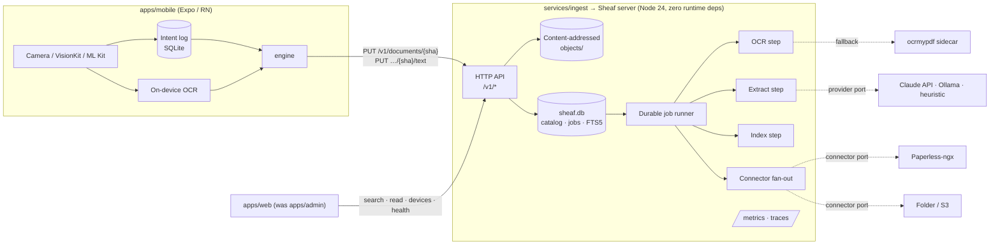
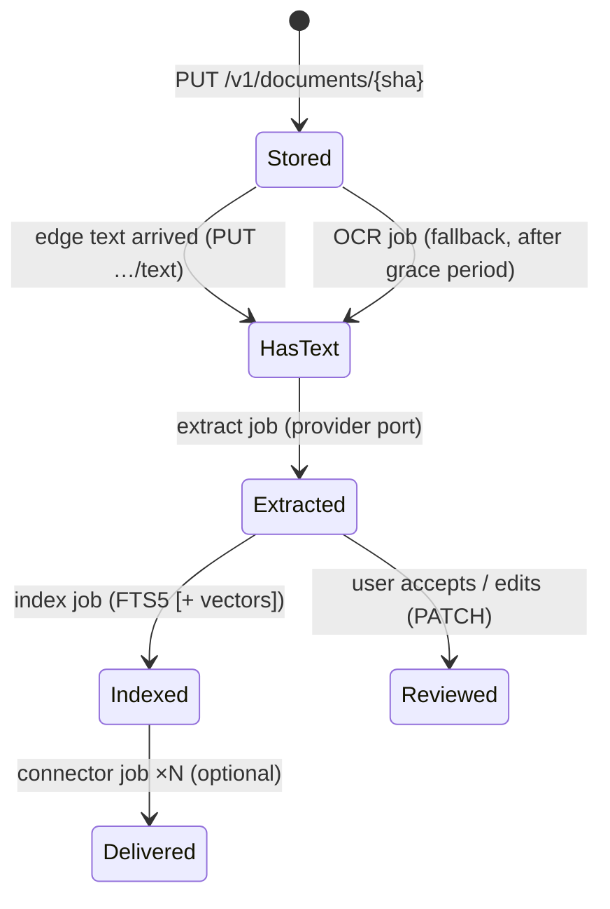

# 02 — Target architecture: Sheaf as the system of record

## One sentence

**Sheaf owns your documents end to end — capture, durable delivery, OCR, search, AI
extraction — and forwards copies to Paperless-ngx (or a folder, or S3) only if you
ask it to.**

Today the arrow points the other way: Sheaf is a door, and Paperless is the house.
This document turns the door into the house without moving a single guarantee the
engine already proves.

## What does not change

Everything below the protocol line stays as it is and keeps its tests:

- `packages/core`, `store`, `engine`, `sim`: the append-only intent log, derived
  status, deterministic simulation. The phone still delivers to
  `PUT /v1/documents/{sha256}` exactly as now.
- `packages/protocol`: **additive only.** No v1 endpoint changes shape; new ones are
  added. A phone built before this plan keeps working against the new server.
- ADRs 0001, 0002, 0005, 0006 stand. ADR 0003 is amended, and ADR 0004 becomes
  Paperless-connector-only, by [ADR 0007](../adr/0007-sheaf-is-the-system-of-record.md).

## System view



## The document pipeline

Upload remains a single idempotent `PUT`. Everything after it is a **durable,
idempotent job keyed by `(sha256, step, step_version)`** — the same pattern the
existing `Forwarder` already uses (`forward_state`, `forward_attempts`,
`forward_next_at`), generalised into one table instead of a set of columns per step.



Rules, each one a test:

1. **A step re-run with the same version is a no-op.** Results are keyed by content
   hash and step version, so a crash mid-step just re-runs it. Same idea as ADR 0002,
   one level up.
2. **Bumping a step's version re-processes lazily.** A better prompt or OCR engine is
   a version bump; the runner backfills in the background. Old results are kept for
   the eval comparison.
3. **Steps never block delivery.** A document is safe the moment `PUT` returns, as
   today. Extraction failing for ever still leaves a stored, searchable-by-title doc.
4. **Post-sync work stays bounded** (invariant 4 in ARCHITECTURE.md): every job has
   backoff, a budget and a terminal `given_up` state.
5. **User edits beat machine output.** A `PATCH` is recorded as `source: user` and
   no later extraction overwrites that field.

The simulator gets a server-side sibling: `services/ingest/test/forward-sim.ts`
already simulates the forwarder. Extend it to the job runner (kills between steps,
provider timeouts, connector 5xx) and assert convergence the same way.

## Data model (server, `sheaf.db`)

Existing `documents` table kept. New tables:

| Table           | Key                          | Holds                                                                     |
| --------------- | ---------------------------- | ------------------------------------------------------------------------- |
| `document_text` | `sha256, source`             | `source ∈ {edge, ocrmypdf, …}`, language, text, engine version            |
| `documents_fts` | FTS5, external content       | title, correspondent, type, tags, text — BM25 ranked                      |
| `extractions`   | `sha256, step_version`       | provider, model, fields JSON, per-field confidence, tokens, cost, latency |
| `fields`        | `sha256, name`               | current value + `source ∈ {machine, user}` (what the UI shows)            |
| `jobs`          | `sha256, step, step_version` | state, attempts, next_at, last_error, timings                             |
| `deliveries`    | `sha256, connector`          | per-connector state, remote id (replaces `forward_*` columns, migrated)   |
| `devices`       | `id`                         | name, `token_hash` (SHA-256 of token), created, last_seen, revoked_at     |
| `pairing_codes` | `code_hash`                  | expires_at (5 min), used_at — single use                                  |

Migrations follow the existing `ADDED_COLUMNS` / `PRAGMA table_info` approach in
`services/ingest/src/storage.ts`, plus a forward-only `schema_migrations` table once
there is more than column-adding to do.

## Protocol additions (`packages/protocol`, all new paths)

| Method & path                      | Purpose                                                           |
| ---------------------------------- | ----------------------------------------------------------------- |
| `POST /v1/pair`                    | Exchange a one-time pairing code for a per-device token           |
| `PUT /v1/documents/{sha}/text`     | Edge OCR text for a stored document (idempotent, by sha + source) |
| `GET /v1/search?q=&limit=&cursor=` | Ranked search over the catalog (BM25; hybrid when vectors on)     |
| `GET /v1/documents/{sha}/fields`   | Current fields + provenance (machine vs user) + confidence        |
| `GET /v1/inbox`                    | Documents with unreviewed machine fields (the triage queue)       |
| `GET/DELETE /v1/devices[/{id}]`    | List / revoke devices (admin scope)                               |
| `GET /v1/connectors`               | Connector status and lag                                          |
| `GET /metrics`                     | Prometheus text format, admin token or loopback only              |

The existing `/v1/archive*` endpoints stay. Their `ArchiveSource` gets a **native
implementation** over the catalog, which becomes the default; the Paperless proxy
remains available when that connector is enabled and configured as "browse source".
The mobile library screen needs no shape change.

## Ports (where the hexagon gets new adapters)

| Port (exists?)                    | Adapters                                                    |
| --------------------------------- | ----------------------------------------------------------- |
| `ForwardTarget` → `Connector` (✔) | `paperless` (exists, moved), `folder`, `s3` (stretch)       |
| `ArchiveSource` (✔)               | `native` (new, default), `paperless` (exists)               |
| `SuggestionSource` (✔)            | `native` = extraction results (new), `paperless` (exists)   |
| `TextRecognizer` (new)            | `edge` (accept phone text), `ocrmypdf` (sidecar over HTTP)  |
| `Extractor` (new)                 | `claude`, `ollama`, `heuristic` (regex dates/totals, no AI) |
| `Embedder` (new, stretch)         | `ollama`, provider API; stored via sqlite-vec               |

`ocrmypdf` runs as **its own container** with a tiny HTTP wrapper, so the Sheaf
server keeps its zero-runtime-dependency Dockerfile. Same reasoning as ADR 0006:
one `docker compose up`, but each thing does one job.

## Security model

- **Device pairing replaces the shared token.** The web app shows a QR code holding
  `{serverUrl, pairingCode}`; the phone scans it and calls `POST /v1/pair`. Codes are
  single use, expire in 5 minutes, and are stored hashed. Device tokens are 256-bit,
  stored only as SHA-256, shown once, revocable from the web app. `SHEAF_TOKEN`
  stays as the **admin/bootstrap** credential. See
  [ADR 0008](../adr/0008-device-pairing.md).
- **Every event attributes a device.** `documents.device_id` makes "which phone sent
  this" answerable, and revocation meaningful.
- **CORS stays `*`** — the ADR-recorded reasoning (bearer tokens, no cookies) still
  holds, and pairing adds no cookies.
- **AI egress is explicit.** Extraction provider defaults to `heuristic` (no network).
  Choosing `claude` is an env var, the web app shows a "documents leave this server"
  badge, and `ollama` keeps it local. Privacy section of README updated to match.
- **Threat model doc** (`SECURITY.md` addendum): stolen phone (device lock + revoke),
  leaked device token (revoke, scoped to upload/read, cannot list devices), malicious
  PDF (size cap exists; OCR sidecar runs unprivileged, no network).

## Observability

Hand-rolled, to keep zero dependencies:

- **Structured JSON logs** with `request_id`, `sha256` (first 12 chars), `device_id`,
  `step`, `duration_ms`. Never tokens, never document text.
- **`/metrics`** (Prometheus exposition): `sheaf_http_requests_total{route,status}`,
  `sheaf_job_duration_seconds{step}` histogram, `sheaf_jobs{step,state}` gauge,
  `sheaf_connector_lag_seconds{connector}`, `sheaf_extraction_cost_usd_total{provider}`.
- **Optional Grafana** in `compose.observability.yml` with one checked-in dashboard
  JSON. Screenshots of it are portfolio material.
- **Health stays** (`/v1/health`), extended with job-queue depth.

## Web app (`apps/admin` → `apps/web`)

Same Vite + React setup, grown from read-only health to:

1. **Search** (the home page) — results with highlighted snippets.
2. **Document view** — PDF, fields with machine/user provenance and confidence,
   and the **paper trail** timeline (events from the phone + server job history).
3. **Inbox** — accept/edit extracted fields; keyboard-driven.
4. **Devices** — pair (QR), list, revoke.
5. **System** — today's health page plus jobs, connectors, cost.

## Deployment

```
compose.yml                  sheaf (server) + ocr (sidecar) — standalone, the default
compose.paperless.yml        adds paperless-ngx + redis and enables the connector
compose.observability.yml    adds prometheus + grafana
```

`docker compose up` with no Paperless is now a complete product, which is the point.

## Non-goals (still)

No multi-tenant SaaS, no CRDT sync (see research §6: single-writer logs do not need
it), no on-phone mirror of the whole archive, no PDF editing.
