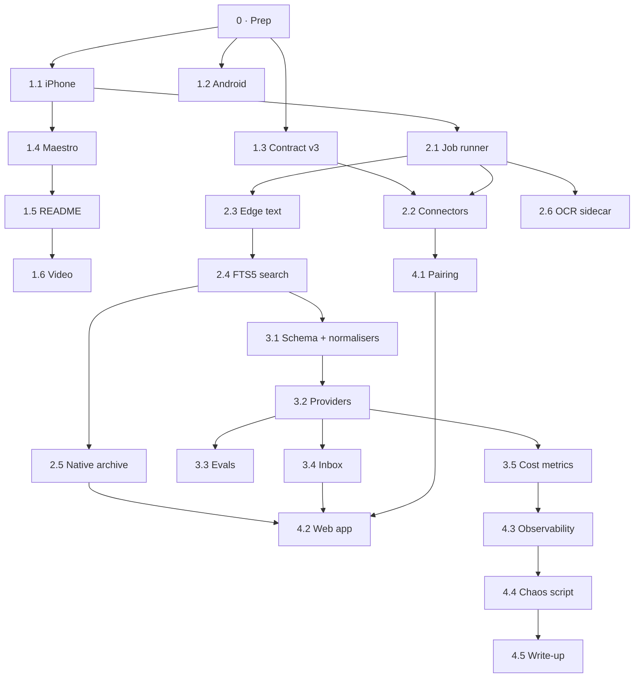

# Implementation guide

The step-by-step version of [the four-week plan](../03-four-week-plan.md). Every
step names the files it touches, the tests to write **first**, the acceptance check,
and the traps already known. Read this page once, then work from the week files.

| Week | File                                                     | Release  |
| ---- | -------------------------------------------------------- | -------- |
| 0    | This page, "Step 0" below                                | —        |
| 1    | [week-1-make-it-real.md](week-1-make-it-real.md)         | `v0.2.0` |
| 2    | [week-2-standalone.md](week-2-standalone.md)             | `v0.3.0` |
| 3    | [week-3-intelligence.md](week-3-intelligence.md)         | `v0.4.0` |
| 4    | [week-4-face-pulse-story.md](week-4-face-pulse-story.md) | `v1.0.0` |

## Dependency graph

Arrows mean "must be merged first". Anything without an arrow between them can be
done in either order.



## Rules that apply to every step

These are the repository's existing habits, written down so new code keeps them.

1. **Ports return results; throws mean crash** ([ADR 0005](../../adr/0005-ports-return-results-and-throw-for-crashes.md)).
   Every new port (`Connector`, `Step`, `Extractor`, `TextRecognizer`) returns
   `ApiResult<T>` from `@sheaf/http` for expected failures. Never wrap a port call in
   `try/catch` inside a runner.
2. **Pure where it can be.** Normalisers, query builders, scoring and the core
   machine take time and randomness as parameters. Extend the ESLint ban on
   `Date.now()` / `Math.random()` (see `eslint.config.mjs`) to every new pure package.
3. **The server keeps zero runtime dependencies.** `services/ingest` uses only
   `node:*`. Call HTTP APIs (Claude, Ollama, the OCR sidecar) with `fetch`, not SDKs.
   The Dockerfile's per-package `COPY` and symlink list must grow with every
   workspace package the server imports, or it fails at **startup**, not build.
4. **No TypeScript syntax that emits code** in anything the server imports (no
   `enum`, no constructor parameter properties, no `namespace`). Node runs it with
   `--experimental-strip-types`. `storage.ts` explains this in a comment.
5. **Protocol changes are additive.** New paths and new optional fields only.
   A phone on the previous release must keep working against the new server.
6. **Schema changes migrate forward and are tested** against a fixture database
   created by the previous release (see step 2.2 for the fixture).
7. **Post-sync work is bounded**: backoff (`backoffMs` in `@sheaf/core`), a budget,
   and a terminal state. No loop may retry a non-retryable `FailureReason`.
8. **Tests first** for anything with an invariant. The week files list them.

## Definition of done (per step)

- [ ] `pnpm verify` is green (format, lint, typecheck, tests)
- [ ] New behaviour has tests; any invariant has a test that would fail without it
- [ ] Docs touched in the same PR: README section, `ARCHITECTURE.md`, or an ADR
      status changed from `proposed` to `accepted` when its step lands
- [ ] One PR per step, squash-merged, with a commit subject in the repo's style:
      an imperative sentence that says what changed for a person, e.g.
      _"Search the documents the server holds, without Paperless"_
- [ ] Manual check from the step's **Acceptance** done and noted in the PR

## Step 0 — Prep (≈1 hour, do first)

1. **Branch and commit the plan.**
   ```bash
   git switch -c docs/roadmap
   git add docs/roadmap docs/adr/0007-* docs/adr/0008-* docs/adr/0009-* docs/adr/0010-*
   git commit -m "Plan Sheaf as a standalone system, and record why"
   ```
2. **Fix the one pre-existing format failure** so CI is a trustworthy signal:
   add `apps/mobile/expo-env.d.ts` to `.prettierignore` (Expo regenerates it).
   Run `pnpm verify` and confirm it is fully green.
3. **Create `CHANGELOG.md`** with an `## Unreleased` section. Every step adds a line.
4. **Open one GitHub issue per step** (optional but good for the portfolio: it shows
   planning). With the `gh` CLI:
   ```bash
   gh issue create --title "1.1 Run on a real iPhone" --body "See docs/roadmap/implementation/week-1-make-it-real.md#11"
   ```
   Group them in a milestone per week (`gh api` or the web UI).
5. **Add `docs/media/`** for screenshots and GIFs, so the README can reference them.
6. **Write down your environment** at the top of `docs/roadmap/implementation/field-notes.md`
   (Xcode version, iPhone model and iOS version, Android device, Node, pnpm). Every
   defect found during the month gets a dated line there. This file becomes the raw
   material for the write-up in step 4.5.
